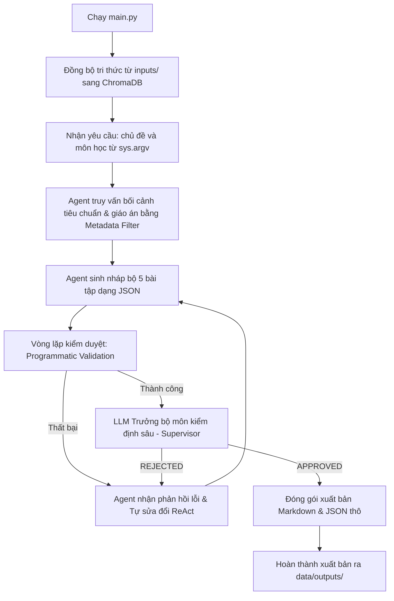

# Hệ thống AI Agent Tự Trị Hỗ Trợ Đào Tạo Rikkei Portal

Hệ thống AI Agent ứng dụng kỹ thuật RAG (Retrieval-Augmented Generation) với ChromaDB cục bộ kết hợp bộ não Gemma2 chạy thông qua Ollama để tự động thiết kế và đóng gói hệ thống bài tập về nhà cho học viên theo đúng tiêu chuẩn nghiệp vụ của Rikkei Academy.

---

## Các tính năng nổi bật

1. **Tự động hóa toàn diện (Automated Pipeline):**
   Khi chạy chương trình, hệ thống sẽ tự động khởi chạy đồng bộ hóa tài liệu tri thức (RAG), sau đó tiếp nhận yêu cầu từ tham số dòng lệnh hoặc nhập trực tiếp từ người dùng, kích hoạt Agent để sinh và xuất bản bài tập mà không cần qua menu lựa chọn phức tạp.

2. **Kiểm duyệt kép (Hybrid Validation & Reflection Loop):**
   * **Kiểm duyệt cứng (Programmatic Validation):** Tự động quét cấu trúc JSON bằng code Python. Bắt buộc 2 bài cơ bản phải có mã người dùng lỗi để học viên vá lỗi, bài 3 yêu cầu báo cáo phân tích, bài 4 có so sánh đa giải pháp, bài 5 có thiết kế kiến trúc; đồng thời chặn nghiêm ngặt quy tắc Đóng HOW (cấm chỉ định sẵn thuật toán).
   * **Kiểm duyệt mềm (LLM Supervisor Evaluation):** LLM Trưởng bộ môn sẽ đối chiếu bài tập với tiêu chuẩn học liệu để phê duyệt (APPROVED) hoặc từ chối (REJECTED).
   * **Tự động sửa lỗi (Self-Correction):** Nếu bị từ chối, Agent sẽ đọc phản hồi lỗi chi tiết, tự động sửa sai qua các lượt ReAct cho đến khi đạt chuẩn 100%.

3. **Định dạng đầu ra chuẩn hóa:**
   Trình xuất bản Markdown tự động phân tách các trường và bố cục theo đúng phân mục (I. Vận dụng cơ bản, II. Vận dụng chuyên sâu, III. Phân tích, IV. Sáng tạo), dùng ký tự đầu dòng `▪` tiêu chuẩn và loại bỏ hoàn toàn phần rubric điểm số theo yêu cầu.

---

## Sơ đồ luồng thực thi hệ thống



---

## Quy tắc kiểm duyệt bài tập chi tiết

Hệ thống áp dụng các quy tắc kiểm duyệt nghiệp vụ tự động để đảm bảo chất lượng giáo án:

| Cấp độ bài tập | Tiêu chí yêu cầu | Thao tác kiểm duyệt |
| :--- | :--- | :--- |
| **I. Vận dụng cơ bản** (Bài 1 & 2) | Yêu cầu vá lỗi code mẫu. | Bắt buộc có trường `code_loi_chua_sua` không rỗng. Yêu cầu các thẻ `[Vấn đề hiện tại]` và `[Yêu cầu đầu ra]`. |
| **II. Vận dụng chuyên sâu** (Bài 3) | Quy tắc nghiệp vụ thực tế. | Yêu cầu học viên nộp 'Báo cáo phân tích' hoặc 'Thiết kế giải pháp' trong phần yêu cầu đầu ra. |
| **III. Phân tích** (Bài 4) | Đề xuất đa giải pháp. | Bắt buộc có yêu cầu học viên phải đề xuất 'Đa giải pháp' và lập bảng 'So sánh/Lựa chọn' trade-off giữa các phương án. |
| **IV. Sáng tạo** (Bài 5) | Thiết kế kiến trúc module. | Yêu cầu kiến trúc hệ thống/luồng dữ liệu và code hoàn chỉnh xử lý toàn diện các case ngoại lệ. |

*Lưu ý:* Tất cả các bài tập đều bị quét tự động từ khóa phát hiện vi phạm quy tắc Đóng HOW (ví dụ: cấm các từ 'sử dụng hàm split', 'dùng vòng lặp for'...).

---

## Hướng dẫn mở rộng đa môn học

Hệ thống thiết kế linh hoạt sử dụng Metadata Filtering. Khi bạn truyền chủ đề bài tập, hệ thống sẽ tự động tách từ khóa tiếng Anh học phần (python, java, web...) để lọc tài liệu:
1. Để thêm môn **Java**, tạo các thư mục tương ứng:
   * `data/inputs/Tieu_Chuan/Java/`
   * `data/inputs/Giao_An/Java/`
2. Khởi chạy:
   ```bash
   python main.py "Bài tập Java OOP"
   ```
   ChromaDB client sẽ tự động bộ lọc `where={"subject": "java"}` để lấy đúng tri thức về lập trình Java, giúp Agent không bị lây lan sang kiến trúc Python hay Web.

---

## Quy chuẩn schema JSON đầu ra

File thông tin gốc `RawAgent_[Chủ_Đề].json` sau khi APPROVED sẽ có định dạng để ready-to-sync với Rikkei Portal API:
```json
{
  "subject": "tên môn học dạng chữ thường (python/java/web)",
  "chu_de": "tên chủ đề học phần viết hoa chữ cái đầu",
  "muc_tieu": "mục tiêu bài học sau khi hoàn thành",
  "danh_sach_bai_tap": [
    {
      "ten_bai": "tên bài tập",
      "muc_do": "cấp độ phân hóa",
      "boi_canh_nghiep_vu": "bối cảnh thực tế đóng vai backend/frontend...",
      "code_loi_chua_sua": "mã nguồn lỗi mẫu hoặc để trống",
      "yeu_cau_chi_tiet": "mô tả kèm các thẻ nghiệp vụ [Quy tắc nghiệp vụ]..."
    }
  ]
}
```

---

## Cấu trúc thư mục dự án

```text
AI_Agent/
├── data/                       # Dữ liệu của hệ thống
│   ├── chroma_db/              # Vector Database (ChromaDB) lưu trữ vĩnh viễn
│   ├── inputs/                 # Tri thức đầu vào (Tiêu chuẩn & Giáo án)
│   │   ├── Tieu_Chuan/         # Tài liệu quy định nghiệp vụ bài tập
│   │   └── Giao_An/            # Giáo trình chuyên môn để tham khảo
│   └── outputs/                # Bài tập đã được phê duyệt & đóng gói
│       ├── raw_json/           # File JSON thô do Agent sinh
│       └── markdown/           # File Markdown giáo án thành phần
│
├── src/                        # Mã nguồn dự án
│   ├── agents/                 # Thiết kế Agent (Base agent & Rikkei Agent)
│   ├── database/               # Kết nối và đồng bộ hóa ChromaDB Vector DB
│   ├── services/               # Kết nối Rikkei Portal API
│   ├── utils/                  # Xuất bản, convert Markdown
│   └── config.py               # Thiết lập cấu hình chung (Folder paths, Model name)
│
├── main.py                     # Entry point chạy tự động của hệ thống
├── requirements.txt            # Danh sách các thư viện phụ thuộc
└── README.md                   # Tài liệu hướng dẫn sử dụng này
```

---

## Hướng dẫn cài đặt và vận hành

### 1. Cài đặt thư viện phụ thuộc
Kích hoạt môi trường ảo (venv) của bạn và tiến hành cài đặt các package:
```bash
pip install -r requirements.txt
```

### 2. Khởi động Ollama Local
Đảm bảo bạn đã cài đặt Ollama và tải model `gemma2` về máy local:
```bash
ollama run gemma2
```

### 3. Chuẩn bị tài liệu tri thức (RAG Inputs)
* Lưu các file tiêu chuẩn thiết kế bài tập vào: `data/inputs/Tieu_Chuan/` (Ví dụ: `data/inputs/Tieu_Chuan/Python/tieuchuan_bai_tap.txt`)
* Lưu các file giáo án lý thuyết vào: `data/inputs/Giao_An/` (Ví dụ: `data/inputs/Giao_An/Python/giao_trinh_string.txt`)

### 4. Chạy hệ thống tự động hóa

#### Cách 1: Truyền trực tiếp chủ đề qua tham số dòng lệnh (Khuyến khích)
Đây là cách tốt nhất trên Windows để tránh các lỗi mã hóa ký tự unicode khi nhập từ bàn phím:
```bash
python -X utf8 main.py "Bài tập String"
```
Hệ thống sẽ tự động chạy toàn bộ pipeline: Đọc file -> Ingest long-term memory -> Gọi Agent sinh bài tập -> Kiểm duyệt cứng/mềm tự động -> Xuất bản Markdown.

#### Cách 2: Chạy tương tác trực tiếp
```bash
python -X utf8 main.py
```
Hệ thống sẽ hoàn tất đồng bộ, sau đó hiển thị dòng nhập cho bạn điền chủ đề mong muốn.
